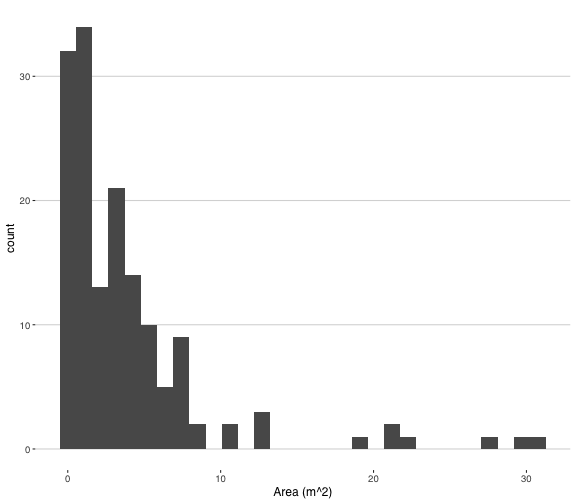
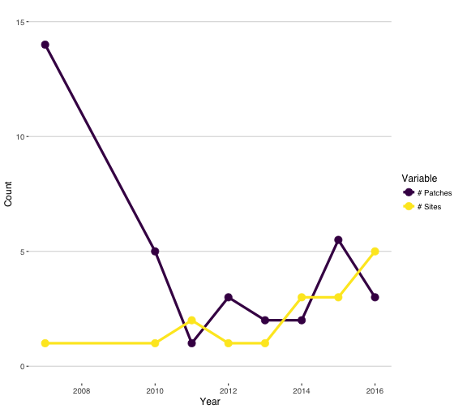
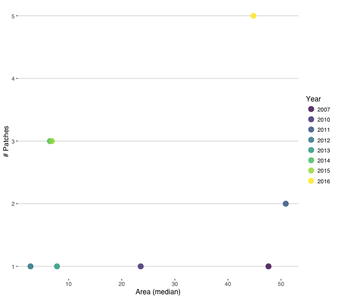

## Abstract

Since 2007, U.S. Fish and Wildlife Service personnel have monitored populations of _Lilaeopsis schaffneriana_ var. _recurva_ (LSR), a species listed as endangered under the U.S. Endangered Species Act, at San Bernardino and Leslie Canyon National Wildlife Refuges in southeast Arizona. The species is a desert wetland obligate whose range has been substantially reduced by more than a century of land use that reduced the number, extent, and natural dynamics of wetlands in Arizona and Sonora, Mexico. Here we analyze monitoring data for 2007 and 2010-2016. We show that the area occupied by and number of patches of LSR exhibits high inter-annual variability, with a general decline to 2015 and an increase in 2016. The number of sites (separate groups of patches) where LSR is found on the refuges has steadily increased from one in 2007 to five in 2016, adding resiliency and redundancy for these populations. These results paint a generally positive picture of LSR status on the refuges, but the variability of populations highlights how biological and hydrological variability still pose a significant risk to the species.

## Introduction

Since 2007, U.S. Fish and Wildlife Service personnel have monitored populations of _Lilaeopsis schaffneriana_ var. _recurva_ (LSR), a species listed as threatened under the U.S. Endangered Species Act (ESA), at San Bernardino and Leslie Canyon National Wildlife Refuges (SBLCNWR) in southeast Arizona. The species is a desert wetland obligate whose range has been substantially reduced by more than a century of land use that reduced the number, extent, and natural dynamics of wetlands in Arizona and Sonora, Mexico. LSR historically occurred on San Bernardino NWR but was apparently extirpated by the late 1990s, and plugs were transplanted in Leslie Canyon NWR in the 1990s, where the species still persists today. 

The LSR monitoring protocol requires that multiple people independently identify patches of the species at a given site, sketch the extent of those patches, and measure the patches (to the nearest 0.1m) and record the measurements on the sketches. After field work is complete, the sketches and their measurements are returned to the lab and computer software - either TurboCAD or ArcGIS - is used to draw representations of each patch to the scale dictated by the measurements. From these digital renderings the areal extent of LSR can be estimated for each site and as measured by each observer.

Here we analyze LSR monitoring data from the years 2007, 2010, 2011, 2012, 2013, 2014, 2015, 2016 and across 5 sites at SBLCNWRs.

## Data overview

Before attempting an analysis, we provide a summary of the data. First, a simple look at the first few lines of data:


| Year | Site  | Patch | Observer | Obs_2 | Area |
|:----:|:-----:|:-----:|:--------:|:-----:|:----:|
| 2007 | LCNWR |   1   |    2     |   2   | 1.88 |
| 2007 | LCNWR |   2   |    2     |   2   | 1.65 |
| 2007 | LCNWR |   3   |    2     |   2   | 3.90 |
| 2007 | LCNWR |   4   |    2     |   2   | 7.23 |
| 2007 | LCNWR |   5   |    2     |   2   | 7.32 |
| 2007 | LCNWR |   6   |    2     |   2   | 7.84 |

Note that the `Obs_2` variable is a re-coding of the `Observer` variable, which is needed for the __Analysis__, below.

Next, we need to know the distribution of the area occupied:



And summarize the other variables:


| # Years | # Sites | Mean # patches | Mean # observers |
|:-------:|:-------:|:--------------:|:----------------:|
|    8    |    5    |      5.12      |       3.25       |

## Figures

As an initial overview of relationships among variables, we will calculate the sum of the area estimated by each observer each year and plot those points and boxplots:


This figure shows that the total amount of LSR on SBLCNWR is highly variable between years. The between-observer variation tends to be small relative to the inter-annual variation, but we're not sure what is going on with the 2011 and 2012 data. (Most years the individual point estimates are relatively tight, but there's an obvious outlier for 2011 [low] and 2012 [high].)

What are the median and mean estimates of LSR area occupied by year?


| Year | Median Area | Mean Area |
|:----:|:-----------:|:---------:|
| 2007 |    47.63    |   50.59   |
| 2010 |    23.57    |   23.55   |
| 2011 |    50.88    |   44.73   |
| 2012 |    2.82     |   7.97    |
| 2013 |    7.81     |   8.11    |
| 2014 |    6.47     |   5.62    |
| 2015 |    6.84     |   6.48    |
| 2016 |    44.80    |   45.81   |

At how many sites and how many patches was LSR found, by year?



The inter-annual variation of area occupied by LSR and number of discrete patches is relatively high and there is no single trend: the apparent negative trend in number of patches is driven by the high number of patches in 2007. In contrast, the number of sites at which LSR is found has steadily increased since 2007. 



## Analysis

Analyzing the LSR monitoring data is a little tricky. We're interested in estimating a population "trend," but need to also determine how important inter-individual variation is to such a trend estimate. The observers are fundamentally a random effect, which necessitates a mixed-model approach. To evaluate the relative importance of `Year` vs. `Observer`, we can craft a set of models with different parameterizations, including fixed `Year` effects with a polynomial (order = 2), random `Year` effects, and random `Observer` effects. If `Observer` is relatively unimportant, we should expect models lacking the term to fit substantially better than models with the term, or models with both terms fitting about the same as `Year`-only models.


```r
mod1 <- lmer(Area ~ poly(Year, 2) + (1|Obs_2), data = LSR_monitor)
mod1b <- lmer(Area ~ (1|Year) + (1|Obs_2), data = LSR_monitor)
mod2 <- lm(Area ~ poly(Year, 2), data = LSR_monitor)
mod3 <- lmer(Area ~ (1|Obs_2), data = LSR_monitor)
mod4 <- lmer(Area ~ (1|Year), data = LSR_monitor)

anova(mod1, mod1b, mod2, mod3, mod4)
```

```
## refitting model(s) with ML (instead of REML)
```

```
## Data: LSR_monitor
## Models:
## mod3: Area ~ (1 | Obs_2)
## mod4: Area ~ (1 | Year)
## mod1b: Area ~ (1 | Year) + (1 | Obs_2)
## mod2: Area ~ poly(Year, 2)
## mod1: Area ~ poly(Year, 2) + (1 | Obs_2)
##       Df    AIC    BIC  logLik deviance  Chisq Chi Df Pr(>Chisq)    
## mod3   3 911.02 920.09 -452.51   905.02                             
## mod4   3 856.90 865.97 -425.45   850.90 54.120      0  < 2.2e-16 ***
## mod1b  4 858.90 870.99 -425.45   850.90  0.000      1          1    
## mod2   4 946.74 958.84 -469.37   938.74  0.000      0          1    
## mod1   5 900.40 915.52 -445.20   890.40 48.345      1  3.574e-12 ***
## ---
## Signif. codes:  0 '***' 0.001 '**' 0.01 '*' 0.05 '.' 0.1 ' ' 1
```

We see that models 1b and 4 have nearly-identical AIC scores that are nearly 50 AIC units lower than the next-best model. Both of these models include `Year` as a random effect term but without a polynomial (`Year` is treated as a discrete factor rather than a continuous numeric variable). That is, these models fit better than all other models considered. Because they are nearly equivalent, but model 1b has an extra term for `Observer` to achieve similar fit, we can conclude that the inter-annual variation is more important for explaining the variation in the data.

## Discussion

Population monitoring is a key component of managing wildlife, especially when the managed species is threatened or endangered. Since 2007, FWS personnel have monitored the populations of an endangered plant, _Lilaeopsis schaffneriana_ var. _recurva_. This analysis shows that the total area occupied by the species and the number of patches of the species exhibit high inter-annual variability. Variation in water availability (especially in Leslie Canyon), flooding, and succession by other herbaceous vegetation all contribute to the variability. It also shows that the number of sites where LSR is found has steadily increased since 2007, which is good thing because more sites translates to increased resiliency and redundancy, two of three components of the [Three Rs](https://goo.gl/W4DaXD) for conservation.

We found that inter-observer variability is small relative to inter-annual variability. One response to this result could be that additional observers are not necessary, but we would caution against this conclusion for two reasons. _First_, while the 2007-2016 data exhibited high inter-annual variability, a period of low variability could make accounting for observer variability much more important. Consider the area occupied during the period 2013-2015 (Figure 2): it's possible to connect a single dot from each of those years to show a population increase or decline. But with the data points from all four observers it is clear that there is a lot of observer variability and no conclusion about a trend one way or another. _Second_, the outlier total area estimates from 2011 and 2012 highlight that there can be dramatic differences among observers. The raw data from the field is no longer available for these two years, and even if it was, there is no way to travel back in time to double-check the measurements. We recommend that the field data be entered (i.e., the polygons drawn and areas estimated), and the per-observer estimates of total area calculated, within a day or two of making the measurements. If there is one outlier, then the sites should be revisited by all observers (if possible) to try to determine the cause of the discrepancy. It may be that one or two measurements were mis-recorded, or that the observer responsible for the outlier total saw things that others did not. Either way, the use of multiple observers is key to getting as accurate an estimate of area occupied as possible, which is difficult when talking about fuzzily-defined patches of a species in nature.

In summary, the data indicate LSR is subject to high inter-annual variation, likely driven by a combination of hydrological and biological factors. The 2016 data in particular is encouraging because it shows the combination of larger area occupied and a larger number of occupied sites than in the past. We can hope this positive trend continues.


